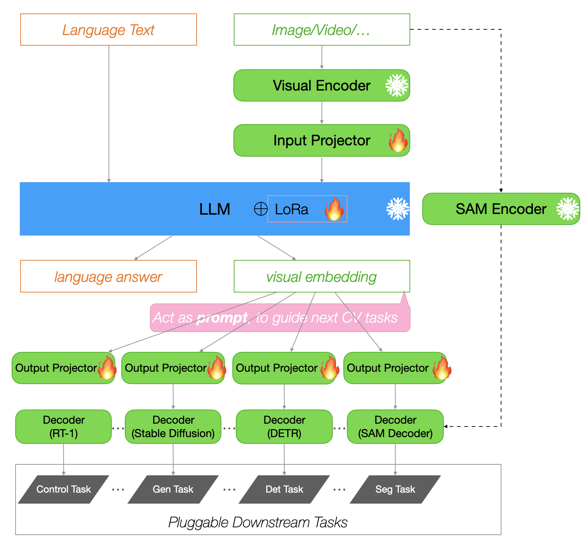

# 1. 背景介绍
The emergence of Multimodal Large Language Models (LLMs) such as GPT-4 has revolutionized AI capabilities by extending their scope beyond textual data processing to incorporate various data types. However, the current landscape of open-source LLMs still tends to be specialized for singular tasks, lacking versatility across multiple functions. For example, models such as LISA are adept at part segmentation, but others, including MiniGPT-4, are confined to generating only text and cannot produce images. Similarly, LLaVa also does not support image generation, thereby highlighting a gap in versatile LLM applications. Furthermore, the specialized focus of these models results in consuming more resources, like CPU and memory, than a single LLM trained for multiple tasks, and diverges from the inherently multifaceted nature of human learning, which is not limited to a single task. 

To address these identified challenges, we introduce the Multi-functional Plugin-Based MLLM in our study. This approach not only integrates a range of tasks into a unified system but also brings an innovative solution for modular task implementation, facilitating straightforward project modifications and updates. Additionally, the model features a user-friendly UI and web interface, enhancing its accessibility. Our approach combines diverse capabilities, such as in-depth object analysis through part segmentation, extensive scene comprehension with panoptic segmentation, contextual image captioning, and image creation from text prompts via Stable Diffusion. The design focuses on scalability and adaptability, aiming to streamline the development process, maximize resource efficiency, and enable smooth future enhancements. Our goal is to diminish the divide in processing textual and visual data, equipping AI systems to understand and produce content in multiple modalities, akin to human cognitive processes.


## 2 Architecture Design
Based on the aforementioned research, we have designed the overall network architecture of the Foundation Model, which includes:

1. Support for multimodal input, achieving alignment between different modalities;
2. LLM as the Backbone, interpreting user instructions for reasoning, and generating Latent Prompt Embedding;
3. Task-specific Decoders, based on the generated Prompt Embedding, to complete various tasks;

**Overall model architecture is illustrated in the figure below**：<br>


In the architecture mentioned above, modules marked with a snowflake represent those with frozen parameters, modules marked with a flame are involved in training, and unmarked modules can be fine-tuned as required. The functionality of each module is described as follows:<br>

**1. Visual Encoder**
    
    Used for encoding images (or videos) into token embeddings that are consumable by the LLM, essentially acting as an LLM Adapter. This module is a fundamental step in realizing a multimodal LLM.
Options for encoding include using the Clip image-encoder[31] or IMAGE BIND[32], with IMAGE BIND being beneficial as it has been trained on extensive multimodal corpora, achieving semantic alignment across various modalities.

**2. Input Projector**
    
    Facilitates LLM-centric alignment, aligning the Visual Embeddings generated in the previous step semantically with the input space of the LLM;
This module typically requires training. However, if it has already been trained through a Multi Modal LLM (like LLaVA), it can also be frozen.

**3. LLM**
    
    The Large Language Model, central to the entire architecture, tasked with inference based on user instruction following;
Extends the LLM's vocabulary tokenizer to recognize image processing tokens like  and <seg>;
For instance, in our scenario, we require the LLM to output the token <seg> to indicate the subsequent segmentation task. The LLM output embedding corresponding to <seg> is utilized for downstream tasks.

    
**4. Output Projector**
    
   Engages in Prompt-centric alignment, aligning the LLM Output Embeddings from the previous step semantically with the prompt space of various downstream Task-specific Decoders;

**5. Decoders**
    
    Task-specific Decoders, for example:

    1. Contols Decoder for executing control command generation, with options like RT-1[47], RT-2[48];

    2. Det Decoder for object detection tasks, possibly using DINO Decoder[33];

    3. Seg Decoder for image segmentation tasks, options include SAM Decoder[2];

    4. Gen Decoder for image generation tasks, options include Stable Diffusion Decoder[14];

    5.Others...;

# 3. Related Work

Researches on industry implementation solutions for related tasks is conducted and summarized in the following table:

<table>
<tbody>
    <tr>
        <th valign="bottom">Method Name</th>
        <th valign="bottom">Method Type</th>
        <th valign="bottom">image caption</th>
        <th valign="bottom">semantic segmentation</th>
        <th valign="bottom">referring segmentation</th>
        <th valign="bottom">part segmentation</th>
        <th valign="bottom">panoptic segmentation</th>
        <th valign="bottom">reasoning segmentation</th>
        <th valign="bottom">open vocabulary</th>
        <th valign="bottom">image generation</th>
        <th valign="bottom">video generation</th>
        <th valign="bottom">image inpainting</th>
    </tr>
    <tr>
        <td align="left">SAM[2]</td>
        <td align="center">segmentation</td>
        <td align="center">❌</td>
        <td align="center">❌</td>
        <td align="center">❌</td>
        <td align="center">✔️</td>
        <td align="center">✔️</td>
        <td align="center">❌</td>
        <td align="center">❌</td>
        <td align="center">❌</td>
        <td align="center">❌</td>
        <td align="center">❌</td>
    </tr>
    <tr>
        <td align="left">Semantic SAM[3]</td>
        <td align="center">segmentation</td>
        <td align="center">❌</td>
        <td align="center">✔️</td>
        <td align="center">✔️</td>
        <td align="center">✔️</td>
        <td align="center">✔️</td>
        <td align="center">❌</td>
        <td align="center">✔️</td>
        <td align="center">❌</td>
        <td align="center">❌</td>
        <td align="center">❌</td>
    </tr>
    <tr>
        <td align="left">Grounded SAM[4]</td>
        <td align="center">segmentation</td>
        <td align="center">❌</td>
        <td align="center">✔️</td>
        <td align="center">✔️</td>
        <td align="center">✔️</td>
        <td align="center">✔️</td>
        <td align="center">❌</td>
        <td align="center">✔️</td>
        <td align="center">❌</td>
        <td align="center">❌</td>
        <td align="center">❌</td>
    </tr>
    <tr>
        <td align="left">ODISE[5]</td>
        <td align="center">segmentation</td>
        <td align="center">❌</td>
        <td align="center">✔️</td>
        <td align="center">✔️</td>
        <td align="center">✔️</td>
        <td align="center">✔️</td>
        <td align="center">❌</td>
        <td align="center">✔️</td>
        <td align="center">❌</td>
        <td align="center">❌</td>
        <td align="center">❌</td>
    </tr>
    <tr>
        <td align="left">OpenSeeD[6]</td>
        <td align="center">segmentation</td>
        <td align="center">❌</td>
        <td align="center">✔️</td>
        <td align="center">✔️</td>
        <td align="center">❌</td>
        <td align="center">✔️</td>
        <td align="center">❌</td>
        <td align="center">✔️</td>
        <td align="center">❌</td>
        <td align="center">❌</td>
        <td align="center">❌</td>
    </tr>
    <tr>
        <td align="left">SEEM[7]</td>
        <td align="center">segmentation</td>
        <td align="center">❌</td>
        <td align="center">✔️</td>
        <td align="center">✔️</td>
        <td align="center">❌</td>
        <td align="center">✔️</td>
        <td align="center">❌</td>
        <td align="center">✔️</td>
        <td align="center">❌</td>
        <td align="center">❌</td>
        <td align="center">❌</td>
    </tr>
    <tr>
        <td align="left">SegGPT[8]</td>
        <td align="center">segmentation</td>
        <td align="center">❌</td>
        <td align="center">❌</td>
        <td align="center">✔️</td>
        <td align="center">❌</td>
        <td align="center">❌</td>
        <td align="center">❌</td>
        <td align="center">✔️</td>
        <td align="center">❌</td>
        <td align="center">❌</td>
        <td align="center">❌</td>
    </tr>
    <tr>
        <td align="left">X-Decoder[9]</td>
        <td align="center">comprehensive</td>
        <td align="center">✔️</td>
        <td align="center">✔️</td>
        <td align="center">✔️</td>
        <td align="center">❌</td>
        <td align="center">✔️</td>
        <td align="center">❌</td>
        <td align="center">✔️</td>
        <td align="center">✔️</td>
        <td align="center">❌</td>
        <td align="center">✔️</td>
    </tr>
    <tr>
        <td align="left">VLPart[10]</td>
        <td align="center">segmentation</td>
        <td align="center">❌</td>
        <td align="center">❌</td>
        <td align="center">❌</td>
        <td align="center">✔️</td>
        <td align="center">❌</td>
        <td align="center">❌</td>
        <td align="center">❌</td>
        <td align="center">❌</td>
        <td align="center">❌</td>
        <td align="center">❌</td>
    </tr>
    <tr>
        <td align="left">Caption Any Thing[11]</td>
        <td align="center">caption</td>
        <td align="center">✔️</td>
        <td align="center">❌</td>
        <td align="center">❌</td>
        <td align="center">❌</td>
        <td align="center">❌</td>
        <td align="center">❌</td>
        <td align="center">❌</td>
        <td align="center">❌</td>
        <td align="center">❌</td>
        <td align="center">❌</td>
    </tr>
    <tr>
        <td align="left">RAM[12]</td>
        <td align="center">caption</td>
        <td align="center">✔️</td>
        <td align="center">❌</td>
        <td align="center">❌</td>
        <td align="center">❌</td>
        <td align="center">❌</td>
        <td align="center">❌</td>
        <td align="center">❌</td>
        <td align="center">❌</td>
        <td align="center">❌</td>
        <td align="center">❌</td>
    </tr>
    <tr>
        <td align="left">BLIP2[13]</td>
        <td align="center">caption</td>
        <td align="center">✔️</td>
        <td align="center">❌</td>
        <td align="center">❌</td>
        <td align="center">❌</td>
        <td align="center">❌</td>
        <td align="center">❌</td>
        <td align="center">❌</td>
        <td align="center">❌</td>
        <td align="center">❌</td>
        <td align="center">❌</td>
    </tr>
    <tr>
        <td align="left">Stable Diffusion[14]</td>
        <td align="center">generation</td>
        <td align="center">❌</td>
        <td align="center">❌</td>
        <td align="center">❌</td>
        <td align="center">❌</td>
        <td align="center">❌</td>
        <td align="center">❌</td>
        <td align="center">❌</td>
        <td align="center">✔️</td>
        <td align="center">❌</td>
        <td align="center">✔️</td>
    </tr>
    <tr>
        <td align="left">Video LDM[15]</td>
        <td align="center">generation</td>
        <td align="center">❌</td>
        <td align="center">❌</td>
        <td align="center">❌</td>
        <td align="center">❌</td>
        <td align="center">❌</td>
        <td align="center">❌</td>
        <td align="center">❌</td>
        <td align="center">❌</td>
        <td align="center">✔️</td>
        <td align="center">❌</td>
    </tr>
    <tr>
        <td align="left">EMU[16]</td>
        <td align="center">comprehensive</td>
        <td align="center">✔️</td>
        <td align="center">❌</td>
        <td align="center">❌</td>
        <td align="center">❌</td>
        <td align="center">❌</td>
        <td align="center">❌</td>
        <td align="center">❌</td>
        <td align="center">✔️</td>
        <td align="center">❌</td>
        <td align="center">❌</td>
    </tr>
    <tr>
        <td align="left">MiniGPT4[17]</td>
        <td align="center">comprehensive</td>
        <td align="center">✔️</td>
        <td align="center">❌</td>
        <td align="center">❌</td>
        <td align="center">❌</td>
        <td align="center">❌</td>
        <td align="center">❌</td>
        <td align="center">❌</td>
        <td align="center">❌</td>
        <td align="center">❌</td>
        <td align="center">❌</td>
    </tr>
    <tr>
        <td align="left">LLaVA[18]</td>
        <td align="center">comprehensive</td>
        <td align="center">✔️</td>
        <td align="center">❌</td>
        <td align="center">❌</td>
        <td align="center">❌</td>
        <td align="center">❌</td>
        <td align="center">❌</td>
        <td align="center">❌</td>
        <td align="center">❌</td>
        <td align="center">❌</td>
        <td align="center">❌</td>
    </tr>
    <tr>
        <td align="left">LISA[19]</td>
        <td align="center">comprehensive</td>
        <td align="center">❌</td>
        <td align="center">❌</td>
        <td align="center">❌</td>
        <td align="center">❌</td>
        <td align="center">❌</td>
        <td align="center">✔️</td>
        <td align="center">❌</td>
        <td align="center">❌</td>
        <td align="center">❌</td>
        <td align="center">❌</td>
    </tr>
    <tr>
        <td align="left">XGPT[20]</td>
        <td align="center">comprehensive</td>
        <td align="center">✔️</td>
        <td align="center">✔️</td>
        <td align="center">✔️</td>
        <td align="center">❌</td>
        <td align="center">✔️</td>
        <td align="center">❌</td>
        <td align="center">✔️</td>
        <td align="center">✔️</td>
        <td align="center">❌</td>
        <td align="center">✔️</td>
    </tr>
    <tr>
        <td align="left">PandaGPT[21]</td>
        <td align="center">comprehensive</td>
        <td align="center">✔️</td>
        <td align="center">❌</td>
        <td align="center">❌</td>
        <td align="center">❌</td>
        <td align="center">❌</td>
        <td align="center">❌</td>
        <td align="center">❌</td>
        <td align="center">❌</td>
        <td align="center">❌</td>
        <td align="center">❌</td>
    </tr>
    <tr>
        <td align="left">NExT-GPT[22]</td>
        <td align="center">comprehensive</td>
        <td align="center">✔️</td>
        <td align="center">❌</td>
        <td align="center">❌</td>
        <td align="center">❌</td>
        <td align="center">❌</td>
        <td align="center">❌</td>
        <td align="center">❌</td>
        <td align="center">✔️</td>
        <td align="center">✔️</td>
        <td align="center">❌</td>
    </tr>
</tbody>
</table>


# 4. Core Implementation
## 4.1 Code Architecture
Most open-source MLLM (Multimodal Large Language Model) codebases, initially coded with a focus on specific tasks of interest, exhibit poor extensibility and lack good abstractions for plugging in subsequent tasks.
Here, with an eye towards "① flexibility" and "② ease of use" for the expansion of future multimodal tasks, the code architecture is designed, encompassing the following key features:

**1. Unified train & inference process template design**<br>
It can serve as a corporate-wide multimodal task framework, supporting various model tasks centered around LLM;

**2. Independently pluggable modules within the model**<br>
Flexibly define or replace modules like encoder, projector, tokenizer, backbone, decoder, etc., requiring only simple changes to the yaml configuration<br>

**3. Downstream Decoder Module can be flexibly expanded**<br>
Multi-Decoder design, supporting the addition of new Task Decoders through yaml configuration files;

**4. Highly configurable, enhancing the ease of extensibility**<br>
Use yaml to uniformly manage the various Modules and hyperparameters within the model; an example is as follows:<br>
(1). Module Configuration，
    
        one model:
            type: "one_model"
            dataset: ["cc3m"]
            encoder: clip_encoder
            in_projector: image_proj_13B
            tokenizer: llama2_13B
            llm: llava_13b
            out_projector: mlp_out_13B
            decoder: sam_decoder_h
            conv_type: "plain"
            # 0: pretrain (train encoder and projector), 1: finetune (train decoder and projector), 2: full train (train encoder and decoder projector)
            train_mode: 1

(2). Model Configuration
    
        trainer:
            task: image_text_pretrain
            # optimizer
            lr_sched: "linear_warmup_cosine_lr"
            init_lr: 1e-4
            min_lr: 8e-5
            warmup_lr: 1e-6
            weight_decay: 0.05
            max_epoch: 4
            batch_size_train: 64
            batch_size_eval: 64
            num_workers: 4
            warmup_steps: 5000
            iters_per_epoch: 5000
            output_dir: "output/minigpt4_stage1_pretrain"
            amp: True
            resume_ckpt_path: null
            evaluate: False
            train_splits: ["train"]
            bits: 8
**5. Distributed DeepSpeed training framework, supporting multi-node and multi-GPU setups**


## 4.2 Training
To prevent catastrophic forgetting in LLMs and simultaneously improve training efficiency, the following strategies are chosen: <br>
**1. End2End Tuning**

    1.Visual Encoder，Freeze
        Load weights from CLIP Image Encoder
    2.Input Projector，Freeze
        Load weights from LLaVA的input projector
    3.LLM，Freeze(Tuning with LoRA[30])
        Load weights from LLAMA2-13B，tuning with LoRA，other prompt tuning method referring[27, 28, 29]，apply on transformer decoder block(contains sq-proj, k-proj, v-proj, o-proj)
    4.Output Projector(for Segementation)，Fine Tuning
        Load weights from LISA Output Projector
    5.Decoder(for Segementation)，Freeze
        Load weights from Semantic-SAM。
        (1) In Panoptic Segmentation, it achieves a 1.3% improvement over OpenSeeD[6] and a 6.1% improvement over X-Decoder[9];
        (2) In Part Segmentation, it shows a 4% improvement compared to VLPart[10];
        (3) For high-quality mask generation, it surpasses SAM[2] by 25.4% and SEEM[7] by 2.4%;
    In conclusion, we choose to base our support for various segmentation tasks on Semantic-SAM.

**2. jointly train**<br>
During the training process, the original LLaVA dataset, LLaVA-Instruct-150k, is also incorporated. Following the approach of EMU[16], the detailed description subset and the 'on top of the back of' pattern are removed, resulting in LLaVA-Instruct-130k.


### 4.2.1 Dataset Construction

**1. segmentation任务** <br>
Receiving Reasoning Segmentation instructions;<br>
Receiving Panoptic Segmentation instructions;<br>
Receiving Part Segmentation instructions;<br>

**2. Generation Task** <br>
Based on Stable Diffusion, this will be included in future work due to time constraints

### 4.2.2 Training Details
Currently, training utilizes LLM fine-tuning with lora, and for the SAM projector, full training is required. The estimated parameter quantities are as follows:

```
trainable params: 4,194,304 || all params: 6,742,609,920 || trainable%: 0.06220594176090199
```
Single-machine multi-GPU training is conducted using deepspeed, with code implementation based on PyTorch and Transformer. The entire framework is driven by yaml configuration, allowing for flexible assembly of various components.
            

# 5. Manual
For installation instructions, see [Installation](./docs/install.md)
## 5.1 Training
Refer to the train.sh script. When training, specify the model version (13B or 7B), the dataset directory, and the results directory.
```bash
sh scripts/train.sh
```
## 5.2 Inference
Refer to infer.sh, with the option to set int8 or int4 quantization.
```bash
sh scripts/infer.sh 
```
## 5.3 Switching the Module
### 5.3.1 Switching the Backbone
Currently, the llava 13B is used as the backbone, but it can be switched to 7B by modifying the corresponding yaml file.
Before changing:

```
llm:
  llava_13b:
    type: llava
    model_name_or_path: ${base_dir}/LLaVA/checkpoints/llava-13b-llama-2-13b-chat
    lora_enable: true
    freeze: false
    load_in_8bit: false
    lora_r: 8
one_model:
  type: "one_model"
  llm: llava_13b

```
After changing:
```
llm:
  llava_7b:
    type: llava
    model_name_or_path: ${base_dir}/LLaVA/checkpoints/llava-7b-llama-2-7b-chat
    lora_enable: true
    freeze: false
    load_in_8bit: false
    lora_r: 8
one_model:
  type: "one_model"
  llm: llava_7b

```
### 5.3.2 Switching the Encoder
Currently, the default is to use clip vit-large, but it can be switched to blip or clip-base, requiring modifications to the corresponding yaml file.
Before changing:
```
encoder:
  clip_encoder:
    type: clip
    model_name_or_path: ${base_dir}/LLaVA/checkpoints/clip-vit-large-patch14
    freeze: true
    select_feature_layer: -2
one_model:
  type: "one_model"
  encoder: clip_encoder

```
After changing:

```
encoder:
  clip_base_encoder:
    type: clip
    model_name_or_path: ${base_dir}/LLaVA/checkpoints/clip-vit-base-patch14
    freeze: true
    select_feature_layer: -2
one_model:
  type: "one_model"
  encoder: clip_base_encoder

```

### 5.3.3 Switching the Projecter
Currently, we have implemented an MLP projector and a linear projector. To switch between them, the corresponding yaml file needs to be modified.
Before changing:
```
projector:
  image_proj_7B:
    type: "linear"
    in_features: 1024
    out_features: 4096
    freeze: true
    ckpt_path: ${base_dir}/LLaVA/tools/7B_mm_projector.pt
one_model:
  type: "one_model"
  in_projector: image_proj_7B

```
After changing:
```
projector:
  image_proj_13B:
    type: "linear"
    in_features: 1024
    out_features: 5120
    freeze: true
    ckpt_path: ${base_dir}/LLaVA/tools/13B_mm_projector.pt
one_model:
  type: "one_model"
  in_projector: image_proj_13B
```
## 5.4 Adding the Decoder
Currently, the default is to use the SAM decoder for segmentation tasks. If you want to add another decoder, you need to implement the decoder's forward method yourself. An example is as follows:

```python
@DECODER_REGISTRY.register(alias="custom_decoder")
class CustomDecoder(nn.Module):
    def __init__(self, model_name_or_path, model_type, train_mask_decoder) -> None:
        super().__init__()
        # TODO init model logic

    def forward(
        self,
        image_paths,
        hidden_states,
        gt_masks,
        inference,
        seg_token_mask,
        offset: torch.LongTensor,
        **kwargs,
    ):
        

    @staticmethod
    def from_config(config):
        model_name_or_path = config.get("model_name_or_path")
        train_mask_decoder = config.get("train_mask_decoder", True)
        model_type = config.get("model_type", "sam_l")
        return CustomDecoder(
            model_name_or_path,
            model_type,
            train_mask_decoder,
        )

```

# 6. Future Work
1. Simulation work, which will be implemented in the future;
2. End-to-End AD (Autonomous Driving) work, which will also be implemented in the future;


# 7. References
[1] OOD Survey - Generalized Out-of-Distribution Detection- A Survey <br>
[2] SAM - Segment Anything <br>
[3] Semantic SAM - Segment and Recognize Anything at Any Granularity <br>
[4] Grounded SAM - https://github.com/IDEA-Research/Grounded-Segment-Anything <br>
[5] ODISE - Open-Vocabulary Panoptic Segmentation with Text-to-Image Diffusion Models <br>
[6] OpenSeeD - A Simple Framework for Open-Vocabulary Segmentation and Detection <br>
[7] SEEM - Segment Everything Everywhere All at Once <br>
[8] SegGPT- Segmenting Everything In Context <br>
[9] X-Decoder - Generalized Decoding for Pixel, Image, and Language <br>
[10] VLPart - Going Denser with Open-Vocabulary Part Segmentation <br>
[11] Caption Anything- Interactive Image Description with Diverse Multimodal Controls <br>
[12] RAM - Recognize Anything- A Strong Image Tagging Model <br>
[13] BLIP-2- Bootstrapping Language-Image Pre-training with Frozen Image Encoders and Large Language Models <br>
[14] Stable Diffusion - High-Resolution Image Synthesis with Latent Diffusion Models <br>
[15] Video LDM - Align your Latents- High-Resolution Video Synthesis with Latent Diffusion Models <br>
[16] EMU - Generative Pretraining in Multimodality <br>
[17] MiniGPT-4- Enhancing Vision-Language Understanding with Advanced Large Language Models <br>
[18] LLaVA - Visual Instruction Tuning <br>
[19] LISA - REASONING SEGMENTATION VIA LARGE LANGUAGE MODEL <br>
[20] XGPT - https://github.com/microsoft/X-Decoder/tree/xgpt <br>
[21] PandaGPT - One Model To Instruction-Follow Them All <br>
[22] NExT-GPT - Any-to-Any Multimodal LLM <br>
[23] LLAMA2 - Open Foundation and Fine-Tuned Chat Models <br>
[24] Alpaca - A Strong, Replicable Instruction-Following Model <br>
[25] Vicuna - An Open-Source Chatbot Impressing GPT-4 with 90%* ChatGPT Quality <br>
[26] CoT - Chain-of-Thought Prompting Elicits Reasoning in Large Language Models <br>
[27] Adapter tuning - Parameter-Efficient Transfer Learning for NLP <br>
[28] Prefix-Tuning - Optimizing Continuous Prompts for Generation <br>
[29] Prompt Tuning - The Power of Scale for Parameter-Efficient Prompt Tuning <br>
[30] LoRA - Low-Rank Adaptation of Large Language Models <br>
[31] CLIP - Learning Transferable Visual Models From Natural Language Supervision <br>
[32] IMAGEBIND - One Embedding Space To Bind Them All <br>
[33] Grounding DINO - Marrying DINO with Grounded Pre-Training for Open-Set Object Detection<br>
[34] Wayve @ cvpr 2023 E2EAD(end2end Autonomous Driving) workshop : https://www.youtube.com/watch?v=Rn9mvSDdSqo<br>
[35] Tesla @ cvpr 2023 WAD(workshop ON Autonomous Driving) : https://www.youtube.com/watch?v=6x-Xb_uT7ts<br>
[36] Data Synthesis with Stable Diffusion for Dataset Imbalance - Computer Vision<br>
[37] Offline reinforcement learning as one big sequence modeling problem<br>
[38] Decision Transformer - Reinforcement Learning via Sequence Modeling<br>
[39] Wayve GAIA-1 - A Generative World Model for Autonomous Driving<br>
[40] PaLM-E - An Embodied Multimodal Language Model<br>
[41] ViT - An image is worth  16x16 words- Transformers for image recognition at scale<br>
[42] CLIP - Learning Transferable Visual Models From Natural Language Supervision<br>
[43] Point-Bind & Point-LLM- Aligning Point Cloud with Multi-modality for 3D Understanding, Generation, and Instruction Following<br>
[44] Imagen video: High definition video generation with diffusion models<br>
[45] Flexible diffusion modeling of long videos<br>
[46] Structure and content-guided video synthesis with diffusion models<br>
[47] RT-1: Robotics transformer for real-world control at scale <br>
[48] RT-2: Vision-Language-Action Models Transfer Web Knowledge to Robotic Control <br>
[49] LanguageMPC- LARGE LANGUAGE MODELS AS DECISION MAKERS FOR AUTONOMOUS DRIVING
